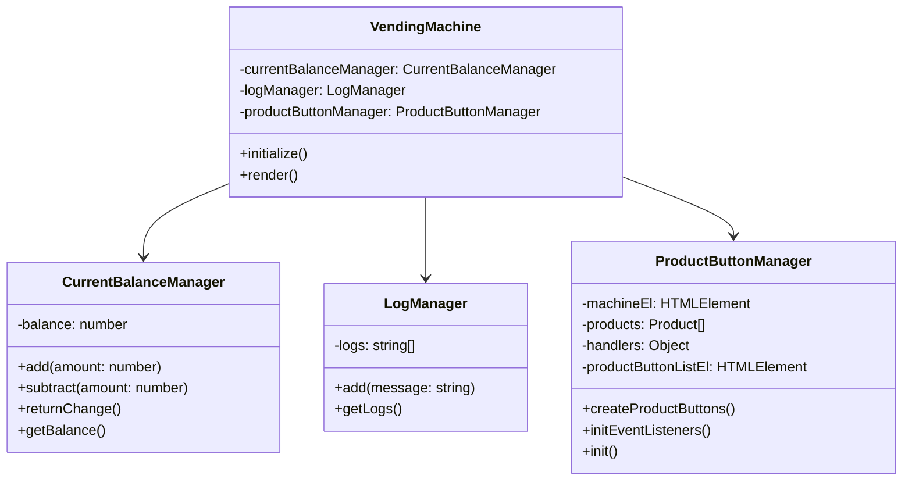
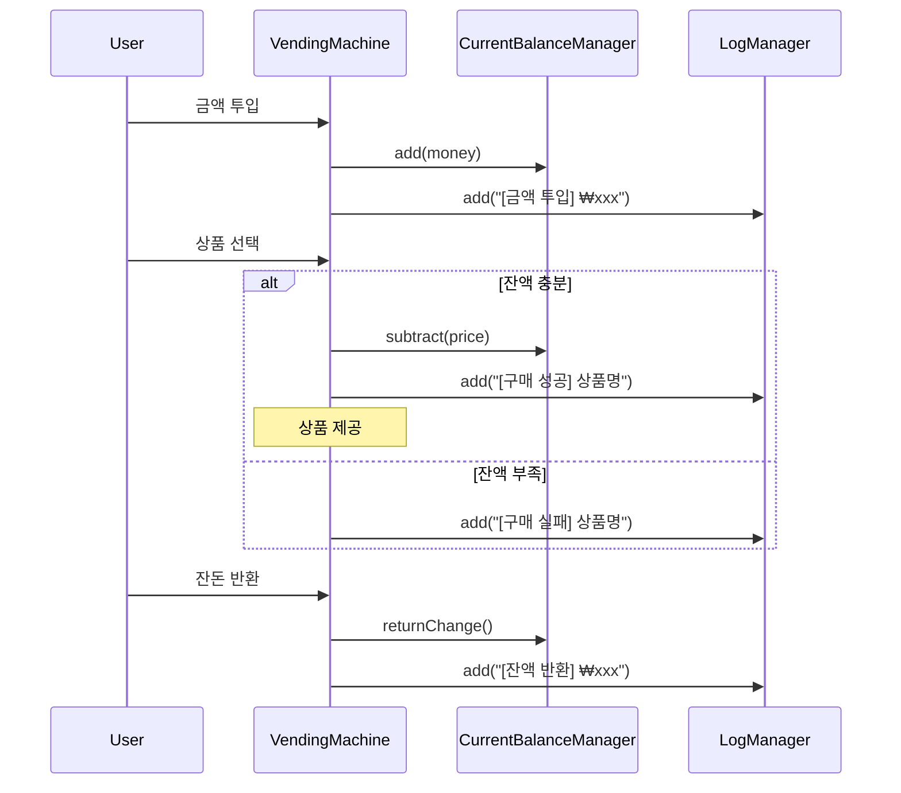
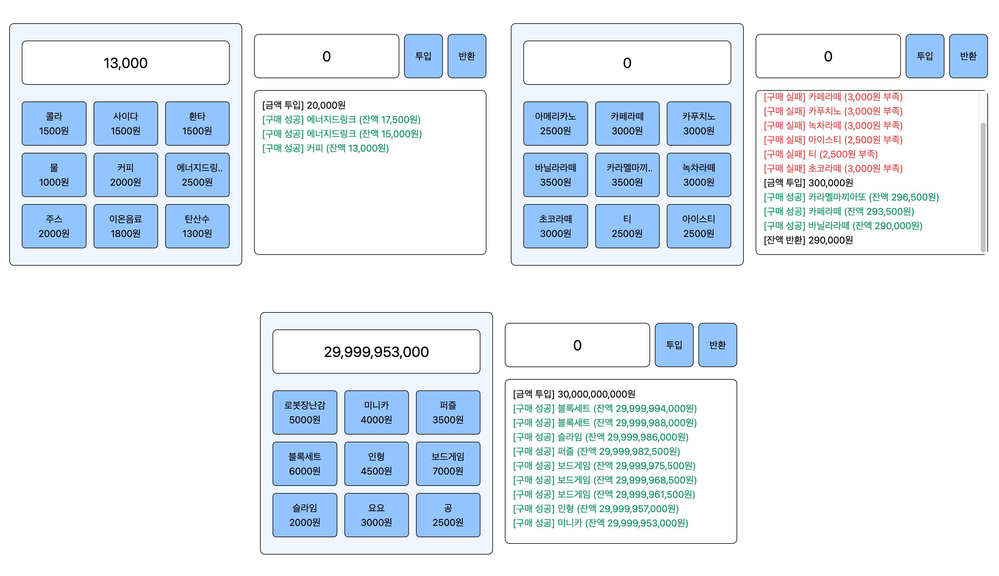

# Vending Machine Project

자바스크립트와 Tailwind CSS를 사용한 자판기 프로젝트입니다.

## 기술 스택

- Vanilla JavaScript
- Tailwind CSS
- Vite (빌드 도구)


## 설치 방법

1. 저장소를 클론합니다:
```bash
git clone [repository-url]
```

2. 프로젝트 디렉토리로 이동:
```bash
cd [project-directory]
```

3. 의존성 패키지를 설치:
```bash
npm install
```

## 실행 방법

### 개발 모드로 실행
```bash
npm run dev
```

### 프로덕션 빌드
```bash
npm run build
```

### 빌드된 버전 미리보기
```bash
npm run preview
```


## 프로젝트 구조

```
.
├── .gitignore
├── README.md
├── assets
│   ├── result.png
│   └── wireframe.png
├── index.html
├── package-lock.json
├── package.json
├── postcss.config.js
├── src
│   ├── components (👉UI 단위 컴포넌트 클래스들)
│   │   └── VendingMachine.js
│   ├── managers (👉각 기능 관리하는 클래스들)
│   │   ├── CurrentBalanceManager.js
│   │   ├── LogManager.js
│   │   └── ProductButtonManager.js
│   ├── styles (👉스타일 관리)
│   │    └── base.css
│   └── main.js (👉컴포넌트 배치)
└── tailwind.config.js

```


## 클래스 다이어그램



## 자판기 동작 로직



## 기능

- 금액 투입
- 상품 선택 및 구매
- 잔돈 반환
- 행동 별 로그 출력

## 화면 미리보기


