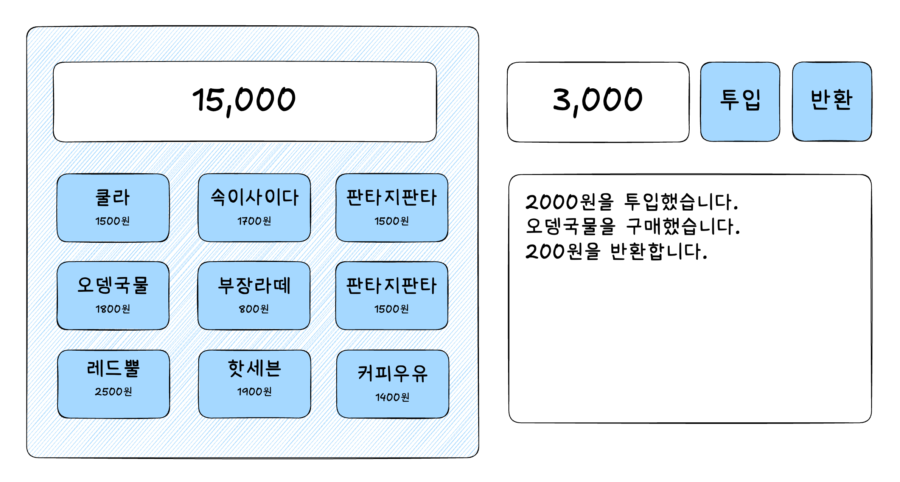

# InnerCircle Frontend Onboarding Project

온보딩 프로젝트로 바닐라 자바스크립트 버전으로 주어진 명세를 만족하는 자판기를 구현합니다.

## 요구사항



### 1. 상품 버튼

#### 기능

- [ ] 상품 버튼이 3x3 배열로 배치됨.
- [ ] 버튼은 두 줄의 텍스트를 포함:
  - 첫 번째 줄: 상품명
  - 두 번째 줄: 상품 가격
- [ ] 버튼 클릭 시:
  - (투입금 표시 화면) 투입된 금액에서 상품 가격 차감
  - (투입금 표시 화면) 금액 부족 시, 버튼 클릭 동안 상품 가격이 금액 표시창에 표시됨
  - (투입금 표시 화면) 버튼 클릭 해제 시 투입된 금액으로 표시 복귀
- [ ] 버튼은 세 가지 상태:
  - Default: 기본 상태.
  - Hover: 마우스가 올라갔을 때
  - Active: 클릭 중일 때

#### 설계 고려사항

- [ ] 상품명과 가격 데이터를 외부에서 유동적으로 설정할 수 있어야 함
- [ ] 금액 검증 로직과 버튼 상태 관리를 분리
- [ ] 상태에 따른 시각적 피드백 (Default, Hover, Active) 명확히 구분

### 2. 금액 표시 화면

#### 기능

- [ ] 버튼이 눌려진 상품 가격을 표시하며, 기본값은 0
- [ ] 숫자는 중간 정렬
- [ ] 항상 숫자값만 표시하며 세 자리마다 쉼표(,) 포함

#### 설계 고려사항

- [ ] 입력된 금액 및 상태 값을 유연하게 반영할 수 있어야 함
- [ ] 숫자 → 쉼표 포맷 변환 로직 필요

### 3. 투입금 표시 화면

#### 기능

- [ ] 금액 입력란을 통해 금액 입력 가능
- [ ] 투입 버튼 클릭 시:
  - 입력된 금액이 금액 표시창에 추가됨
  - 금액 입력란은 초기화

#### 설계 고려사항

- [ ] 입력값 유효성 검증 필요 (숫자, 양수만 허용)
- [ ] 투입 버튼 동작과 입력란 초기화 로직 분리
- [ ] 금액 상태 관리와 UI 업데이트가 독립적으로 작동

### 4. 로그

#### 기능

- [ ] 금액 투입, 상품 구매 등의 모든 동작을 기록.
- [ ] 최신 로그가 아래쪽에 표시되며, 기록이 길어질 경우 스크롤 가능.
- [ ] 새 로그 추가 시 자동으로 가장 아래로 스크롤.

#### 설계 고려사항

- [ ] 로그 메시지를 유동적으로 생성 가능:
  - 금액 투입 : "n원을 투입했습니다."
  - 상품 구매 성공 : "X상품을 구매했습니다."
  - 반환 : "n원을 반환합니다."
- [ ] 로그는 배열 형태로 관리
- [ ] 스크롤 및 자동 스크롤 기능 구현

## 개발 환경
- Node.js v20.10.0
- npm v10.2.3
- Visual Studio Code IDE
- webpack v5.96.1

## Build and Run
- npm run dev : 개발 서버 구동
- npm run build : 빌드

## 프로젝트 Git 커밋 컨벤션
```
type(옵션): Subject  // -> 제목
(한 줄을 띄워 분리합니다.)
- description //  -> 본문
- description //  -> 본문
- description //  -> 본문
...
(한 줄을 띄워 분리합니다.)
*) ... // -> 꼬리말
```

| 태그      | 이름                      | 설명                                               |
|-----------|---------------------------|-------------------------------------------------|
| feat      | 기능 추가           | 새로운 기능을 추가할 경우                                |
| fix       | 버그 수정    | 버그 수정                             |
| chore     | 패키지 매니저 설정          | 코드 수정 없이 설정을 변경 (eslint, prettier 등 패키지 설정)|
| test      | 테스트                   | 테스트 추가 또는 기존 테스트 수정                          |
| docs      | 문서                   | documentation 추가 또는 변경                          |
| refactor      | 리팩토링                   | 버그를 수정하지 않고 기능을 추가하지 않는 코드 변경       |